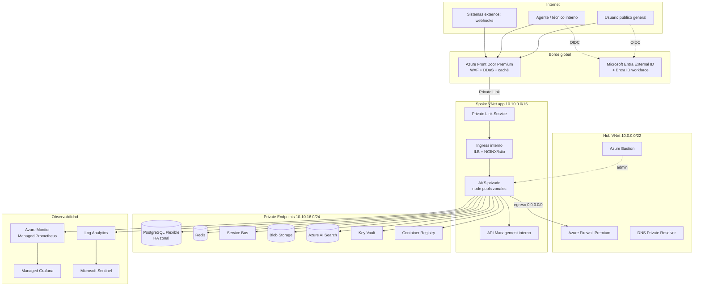
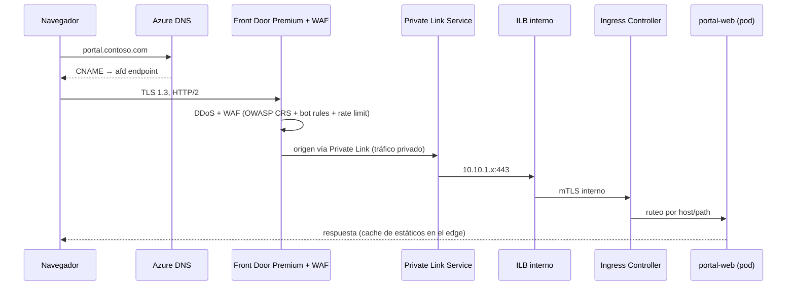
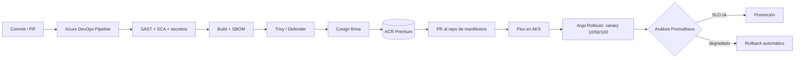

# Arquitectura técnica — Plataforma ITSM (tipo ServiceNow) en Azure

Diseño de referencia para una plataforma de gestión de servicios de TI multi-tenant, con portal de autoservicio expuesto a público general, backend en contenedores sobre AKS, red cerrada por diseño y observabilidad completa.

---

## 1. Alcance funcional

La plataforma cubre los módulos típicos de un ITSM:

| Dominio | Responsabilidad |
|---|---|
| Portal de autoservicio | Registro/login de usuarios finales, catálogo de servicios, alta y seguimiento de tickets |
| Incidencias / Solicitudes | Ciclo de vida ITIL: alta, triage, asignación, escalamiento, cierre |
| Workflow engine | Aprobaciones, tareas encadenadas, SLA timers, reglas de negocio |
| CMDB | Inventario de elementos de configuración y sus relaciones |
| Base de conocimiento | Artículos, búsqueda semántica, sugerencia automática al crear ticket |
| Notificaciones | Correo, Teams/Slack, webhooks salientes |
| Integraciones | API pública, webhooks entrantes, agente de descubrimiento on-prem |
| Reportería / SLA | Dashboards operativos y cumplimiento de acuerdos de servicio |

---

## 2. Vista general



Principio rector: **ningún componente de datos ni de cómputo tiene IP pública**. El único punto de entrada desde Internet es Azure Front Door, y su conexión hacia el spoke viaja por Private Link, no por Internet.

---

## 3. Diseño de red

### 3.1 Topología hub-spoke

Suscripciones separadas por función, agrupadas en management groups bajo un modelo de landing zones:

| Management group | Suscripción | Contenido |
|---|---|---|
| Platform | `sub-connectivity` | Hub VNet, Firewall, Bastion, VPN/ExpressRoute, zonas DNS privadas |
| Platform | `sub-management` | Log Analytics, Automation, Sentinel |
| Landing Zones | `sub-itsm-prod` | Spoke productivo: AKS, datos, ACR, Key Vault |
| Landing Zones | `sub-itsm-nonprod` | Spokes dev/QA con la misma topología a menor escala |

El peering es hub↔spoke con `allowForwardedTraffic` habilitado; los spokes **no** se emparejan entre sí. Todo tráfico inter-spoke pasa por el firewall.

### 3.2 Direccionamiento

| VNet / Subred | CIDR | Notas |
|---|---|---|
| Hub | `10.0.0.0/22` | |
| ↳ `AzureFirewallSubnet` | `10.0.0.0/26` | Nombre obligatorio |
| ↳ `AzureFirewallManagementSubnet` | `10.0.0.64/26` | Requerido en modo forced tunneling |
| ↳ `AzureBastionSubnet` | `10.0.0.128/26` | |
| ↳ `GatewaySubnet` | `10.0.0.192/27` | VPN S2S / ExpressRoute |
| ↳ `snet-dns-inbound` | `10.0.1.0/28` | DNS Private Resolver |
| Spoke app | `10.10.0.0/16` | |
| ↳ `snet-aks-system` | `10.10.4.0/22` | Node pool de sistema |
| ↳ `snet-aks-user` | `10.10.8.0/21` | Node pools de aplicación |
| ↳ `snet-ingress` | `10.10.1.0/24` | ILB interno + Private Link Service |
| ↳ `snet-apim` | `10.10.2.0/24` | APIM modo interno |
| ↳ `snet-privatelink` | `10.10.16.0/24` | Todos los private endpoints |
| Pods (CNI Overlay) | `172.16.0.0/16` | No consume IPs de la VNet |
| Services | `172.20.0.0/16` | `kube-dns` en `172.20.0.10` |

Se usa **Azure CNI Overlay con Cilium** como data plane: los pods reciben IPs de un espacio superpuesto, lo que evita el agotamiento de direcciones de la VNet al escalar, y Cilium aporta network policies con eBPF sin sidecars.

### 3.3 Ingreso público (tráfico norte-sur)

El camino completo de una petición de un usuario anónimo:



**Controles en el borde:**

- **Azure Front Door Premium**: terminación TLS 1.2+ con certificado gestionado o referenciado desde Key Vault, HTTP/2 y HTTP/3, caché de assets estáticos, y redirección forzada HTTP→HTTPS.
- **WAF policy en modo Prevention** con: Microsoft Default Rule Set (DRS 2.1), Bot Manager ruleset, reglas de rate limiting por IP (por ejemplo 100 req/min en `/api/*` y 5 req/min en `/api/auth/register`), y geo-filtrado si el servicio es de alcance nacional.
- **Azure DDoS Network Protection** habilitado en las VNets, con protección L3/L7 combinada con el WAF.
- **Private Link Service** publicando el Internal Load Balancer del ingress controller. Consecuencia: el spoke no tiene ni una sola IP pública y no hay ruta desde Internet hacia el clúster que no atraviese el WAF.

> **Alternativa evaluada.** Application Gateway v2 con WAF como segundo nivel regional detrás de Front Door. Aporta doble inspección y mTLS de cliente (útil si algún integrador exige certificado de cliente), pero requiere IP pública en el AGW, lo que obliga a restringirlo por NSG al service tag `AzureFrontDoor.Backend` y a validar el header `X-Azure-FDID` en el listener. Se prefiere Private Link porque elimina la superficie pública por completo; si el requisito de mTLS aparece, se agrega AGW **interno** entre el PLS y el ingress.

### 3.4 Egreso controlado

Todos los node pools tienen `outboundType: userDefinedRouting` y una UDR que envía `0.0.0.0/0` a la IP privada del Azure Firewall. Esto impide exfiltración hacia destinos arbitrarios desde un pod comprometido.

Reglas mínimas en el firewall:

| Tipo | Destino | Puerto | Justificación |
|---|---|---|---|
| Network rule | Service tag `AzureCloud.<región>` | 443, 9000, 1194 | Plano de control de AKS |
| Network rule | `NTP` (UDP 123) | 123 | Sincronía de reloj |
| Application rule | FQDN tag `AzureKubernetesService` | 443 | Dependencias gestionadas de AKS |
| Application rule | `*.blob.core.windows.net`, `*.azurecr.io` | 443 | Imágenes y artefactos |
| Application rule | FQDNs de SMTP relay / proveedores de correo | 587/443 | Notificaciones |
| Application rule | Lista blanca de integradores (ERP, monitoreo, Teams) | 443 | Integraciones salientes |

Todo lo demás se deniega y se registra. Azure Firewall Premium habilita además **TLS inspection** e **IDPS** para el tráfico saliente.

### 3.5 Tráfico este-oeste

Dentro del clúster se aplica **deny-all por defecto** con `CiliumNetworkPolicy` por namespace, y se abre explícitamente cada relación:

```yaml
apiVersion: cilium.io/v2
kind: CiliumNetworkPolicy
metadata:
  name: ticket-api-ingress
  namespace: itsm-core
spec:
  endpointSelector:
    matchLabels:
      app: ticket-api
  ingress:
    - fromEndpoints:
        - matchLabels:
            app: bff-gateway
            io.kubernetes.pod.namespace: itsm-edge
      toPorts:
        - ports: [{ port: "8443", protocol: TCP }]
  egress:
    - toFQDNs:
        - matchPattern: "*.postgres.database.azure.com"
      toPorts:
        - ports: [{ port: "5432", protocol: TCP }]
    - toEndpoints:
        - matchLabels:
            k8s-app: kube-dns
      toPorts:
        - ports: [{ port: "53", protocol: UDP }]
```

Sobre eso, el addon gestionado de **Istio** provee mTLS estricto (`PeerAuthentication: STRICT`) entre servicios, con rotación automática de certificados. La analogía útil: las network policies son las puertas del edificio, y mTLS es la credencial que cada persona muestra al entrar a cada oficina; hacen falta las dos.

### 3.6 Resolución DNS privada

Zonas privadas ligadas al hub y resueltas desde los spokes vía DNS Private Resolver:

- `privatelink.postgres.database.azure.com`
- `privatelink.redis.cache.windows.net`
- `privatelink.servicebus.windows.net`
- `privatelink.blob.core.windows.net`
- `privatelink.vaultcore.azure.net`
- `privatelink.azurecr.io`
- `privatelink.<región>.azmk8s.io` (API server privado)

---

## 4. Identidad y permisos

### 4.1 Identidad de usuarios

Dos planos de identidad separados, sin mezclar directorios:

| Población | Directorio | Autenticación | Consideraciones |
|---|---|---|---|
| Público general (solicitantes externos) | **Microsoft Entra External ID** (tenant CIAM dedicado) | Self-service sign-up, OTP por correo, federación con Google/Apple/Facebook, MFA opcional obligatoria para cuentas con datos sensibles | Custom user flows, atributos de extensión (`companyId`, `tenantId`), branding propio, verificación de correo obligatoria antes de crear tickets |
| Empleados, agentes N1/N2/N3, aprobadores, administradores | **Entra ID workforce** del corporativo | SSO OIDC, MFA obligatoria, Conditional Access (dispositivo compliant + ubicación) | Aprovisionamiento vía SCIM desde RRHH, grupos dinámicos por departamento |

El portal usa **Authorization Code Flow con PKCE**; los tokens de acceso nunca tocan `localStorage`, se manejan como cookies `HttpOnly`, `Secure`, `SameSite=Lax` emitidas por el BFF. El refresh token se guarda cifrado del lado servidor en Redis.

### 4.2 Autorización de aplicación

Los roles funcionales del ITSM viven como **app roles** en el registro de aplicación y viajan en el claim `roles`; la autorización fina (por ejemplo "este agente solo ve tickets de su cola") se resuelve en el servicio con políticas ABAC evaluadas contra la base de datos.

| Rol | Alcance | Permisos representativos |
|---|---|---|
| `Requester` | Propios | Crear ticket, ver y comentar sus tickets, leer KB pública |
| `Agent.L1` | Cola asignada | Triage, responder, escalar, cerrar incidentes de su cola |
| `Agent.L2` | Cola + CMDB lectura | Todo lo de L1, más relacionar CIs y crear problemas |
| `Approver` | Flujos donde figura | Aprobar/rechazar solicitudes y cambios |
| `ServiceOwner` | Servicio del catálogo | Definir SLAs, editar catálogo, ver reportes del servicio |
| `PlatformAdmin` | Tenant | Configuración global, roles, integraciones |
| `Auditor` | Tenant, solo lectura | Lectura de bitácoras y reportes, sin acceso a datos de contenido |

En multi-tenant, la segregación se refuerza en la base de datos con **Row Level Security** de PostgreSQL usando `current_setting('app.tenant_id')`, de modo que un error de lógica en la aplicación no derive en fuga entre clientes.

### 4.3 Identidad de cargas de trabajo

Cero secretos en el clúster para hablar con Azure. Se usa **Microsoft Entra Workload ID** (federación OIDC entre el issuer del clúster y una Managed Identity):

```yaml
apiVersion: v1
kind: ServiceAccount
metadata:
  name: sa-ticket-api
  namespace: itsm-core
  annotations:
    azure.workload.identity/client-id: <client-id-de-la-managed-identity>
---
apiVersion: apps/v1
kind: Deployment
spec:
  template:
    metadata:
      labels:
        azure.workload.identity/use: "true"
    spec:
      serviceAccountName: sa-ticket-api
```

Cada microservicio tiene su propia identidad administrada con permisos mínimos: `ticket-api` puede leer secretos de un solo Key Vault y escribir en una sola cola de Service Bus; `file-service` es el único con rol `Storage Blob Data Contributor` sobre el contenedor de adjuntos.

### 4.4 RBAC del plano de control

- **AKS con integración Entra ID y Azure RBAC for Kubernetes**: la pertenencia a grupos determina el acceso a namespaces; no existen `kubeconfig` con certificados de cliente locales.
- **Privileged Identity Management (PIM)**: los roles `Azure Kubernetes Service RBAC Cluster Admin`, `Owner` y `Key Vault Administrator` son elegibles, no permanentes. Activación con justificación, aprobación y ventana máxima de 4 horas.
- **Acceso administrativo** exclusivamente por Azure Bastion hacia una jumpbox del hub, o mediante `az aks command invoke` auditado. El API server es privado con `authorizedIPRanges` como red de seguridad adicional.
- **Azure Policy** en modo `deny` para: creación de IPs públicas en los spokes, storage accounts sin private endpoint, recursos sin etiquetas de centro de costo, e imágenes fuera del ACR corporativo.

### 4.5 Secretos y certificados

- **Key Vault Premium** con RBAC (no access policies), purge protection y soft delete, expuesto solo por private endpoint.
- Consumo desde pods vía **Secrets Store CSI Driver** con rotación automática cada 2 minutos; los secretos se montan como archivos, no como variables de entorno, para que no aparezcan en volcados de proceso ni en `kubectl describe`.
- **Cifrado en reposo con llaves administradas por el cliente (CMK)** en PostgreSQL, Storage y discos de nodos, con rotación anual automatizada.
- Certificados TLS internos emitidos por `cert-manager` contra una CA privada; los públicos se gestionan en Front Door.

---

## 5. Plataforma de contenedores

### 5.1 Configuración del clúster

| Parámetro | Valor | Motivo |
|---|---|---|
| Tier | Standard (SLA 99.95% con zonas) | Compromiso de disponibilidad del plano de control |
| API server | Privado, con Private DNS Zone | Sin superficie pública de administración |
| Network plugin | Azure CNI Overlay + Cilium | Ahorro de IPs y policies eBPF |
| Zonas | 1, 2, 3 | Tolerancia a falla de zona |
| Upgrade channel | `stable`, con maintenance window nocturna | Parcheo predecible |
| Node OS | Azure Linux (Mariner), auto-upgrade `NodeImage` | Superficie mínima y parcheo automático |
| Autoscaling | Cluster Autoscaler + Node Autoprovisioning | Elasticidad por costo |
| Add-ons | Managed Prometheus, Container Insights, Istio, Workload Identity, KEDA, Azure Policy, Defender | Todo gestionado, menos operación propia |

### 5.2 Node pools

| Pool | SKU | Escala | Taints | Carga |
|---|---|---|---|---|
| `system` | `Standard_D4s_v5` | 3 fijos (1 por zona) | `CriticalAddonsOnly=true:NoSchedule` | CoreDNS, metrics-server, add-ons |
| `apps` | `Standard_D8s_v5` | 3–15 | — | Microservicios sin estado |
| `workers` | `Standard_D8s_v5` Spot | 0–20 | `scalesetpriority=spot:NoSchedule` | Indexación, reportes, jobs batch |
| `memory` | `Standard_E8s_v5` | 0–4 | `workload=memory:NoSchedule` | Motor de reglas y búsqueda |

### 5.3 Namespaces y microservicios

| Namespace | Servicio | Función | Escalado |
|---|---|---|---|
| `itsm-edge` | `portal-web` | SSR del portal público (Next.js) | HPA por CPU y RPS |
| `itsm-edge` | `bff-gateway` | Backend-for-frontend, validación de token, agregación | HPA por RPS |
| `itsm-core` | `ticket-api` | CRUD de incidentes, solicitudes, cambios | HPA |
| `itsm-core` | `workflow-engine` | Máquina de estados, aprobaciones, SLA timers | KEDA por longitud de cola |
| `itsm-core` | `cmdb-api` | CIs y relaciones (grafo) | HPA |
| `itsm-core` | `catalog-api` | Catálogo de servicios y formularios dinámicos | HPA |
| `itsm-knowledge` | `kb-api` | Artículos y búsqueda | HPA |
| `itsm-knowledge` | `search-indexer` | Indexación incremental hacia AI Search | KEDA por eventos |
| `itsm-integration` | `notification-svc` | Correo, Teams, webhooks salientes | KEDA por cola |
| `itsm-integration` | `webhook-ingress` | Recepción de eventos externos firmados (HMAC) | HPA |
| `itsm-integration` | `discovery-relay` | Puente hacia agentes on-prem vía Azure Relay | Fijo, 2 réplicas |
| `itsm-files` | `file-svc` | Carga/descarga de adjuntos con SAS de corta vida | HPA |
| `observability` | Colector OTel, Grafana Agent | Telemetría | DaemonSet |

Todos los deployments declaran: `requests`/`limits`, `PodDisruptionBudget` (mínimo 1), `topologySpreadConstraints` por zona, `readinessProbe` y `livenessProbe`, y `preStop` con drenaje elegante para despliegues sin caída.

### 5.4 Seguridad de contenedores y cadena de suministro

**En construcción:**
1. Imágenes base distroless o Azure Linux, sin shell.
2. SAST (CodeQL) y análisis de dependencias en cada PR; bloqueo por vulnerabilidades críticas.
3. Escaneo de imagen con Trivy/Defender antes de publicar.
4. Generación de **SBOM** (SPDX) y firma con **Cosign/Notation** usando llaves en Key Vault.
5. Publicación en **ACR Premium** con private endpoint, cuarentena, replicación geográfica y retención de untagged.

**En admisión:**
- `Ratify` + Azure Policy verifica firma y procedencia; una imagen sin firmar no arranca.
- Pod Security Standards en nivel `restricted` por namespace.
- Azure Policy for AKS (Gatekeeper) deniega: `privileged: true`, `hostNetwork`, `hostPID`, montaje de `docker.sock`, capacidades añadidas distintas de `NET_BIND_SERVICE`, y registries fuera de la lista blanca.

**En ejecución:**
```yaml
securityContext:
  runAsNonRoot: true
  runAsUser: 10001
  allowPrivilegeEscalation: false
  readOnlyRootFilesystem: true
  capabilities:
    drop: ["ALL"]
  seccompProfile:
    type: RuntimeDefault
```
Defender for Containers monitorea comportamiento en runtime (procesos inesperados, conexiones anómalas, escapes de contenedor) y alimenta Sentinel.

### 5.5 Escalado

- **HPA** para servicios síncronos, con métricas de RPS y latencia p95 vía Prometheus Adapter, no solo CPU.
- **KEDA** para los asíncronos: `workflow-engine` escala por `activeMessageCount` de Service Bus; `notification-svc` igual; los jobs de reportería escalan por cron.
- **Pod overprovisioning** con un deployment de pods de prioridad negativa que reserva capacidad, para que el arranque de nodos nuevos no impacte la latencia en picos.

---

## 6. Capa de datos

| Servicio | Uso | Configuración |
|---|---|---|
| **Azure Database for PostgreSQL Flexible Server** | Tickets, CMDB, catálogo, usuarios, auditoría | HA zona-redundante, private endpoint, CMK, PITR 35 días, réplica de lectura en región secundaria, `pgaudit` habilitado, RLS por tenant |
| **Azure Cache for Redis Premium** | Sesiones, caché de catálogo, rate limiting distribuido, locks de workflow | Zona-redundante, private endpoint, persistencia AOF |
| **Azure Blob Storage** | Adjuntos, evidencias, exportaciones | Private endpoint, `Deny` público, versionado, immutability policy para evidencias legales, lifecycle a Cool/Archive, Defender for Storage con escaneo antimalware |
| **Azure AI Search** | Búsqueda de KB y de tickets, búsqueda vectorial para sugerencias | Private endpoint, índices por tenant, integración con embeddings |
| **Azure Cosmos DB (opcional)** | Timeline de actividad y notificaciones de alto volumen | Multi-región, consistencia de sesión |

Diseño de datos relevante: el modelo de tickets usa **event sourcing ligero** — una tabla `ticket_events` inmutable como fuente de verdad para auditoría, y proyecciones materializadas para lectura rápida. Esto resuelve el requisito clásico de ITSM de poder reconstruir el estado de un ticket en cualquier momento del pasado.

---

## 7. Mensajería y eventos

- **Azure Service Bus Premium** (private endpoint, zona-redundante) con topics por dominio: `ticket.events`, `workflow.commands`, `notification.outbox`. Sesiones para garantizar orden por ticket, dead-letter queues con alerta y reproceso manual.
- **Patrón Transactional Outbox**: el servicio escribe el evento en la misma transacción de PostgreSQL que el cambio de estado, y un publicador lo mueve a Service Bus. Elimina el caso de "ticket actualizado pero notificación perdida".
- **Azure Event Grid** para eventos de infraestructura (blob creado → disparar escaneo antimalware y extracción de texto).
- **Azure Relay Hybrid Connections** para el agente de descubrimiento on-premises: el agente en la red del cliente abre una conexión saliente HTTPS y recibe trabajos, sin necesidad de abrir puertos entrantes ni VPN. Es el equivalente funcional al MID Server de ServiceNow.

---

## 8. Monitoreo y observabilidad

Cuatro señales, cada una con su destino:

| Señal | Herramienta | Detalle |
|---|---|---|
| **Métricas** | Azure Monitor Managed Prometheus + **Azure Managed Grafana** | Scraping vía `PodMonitor`/`ServiceMonitor`, retención 18 meses, dashboards de negocio (tickets abiertos por cola, cumplimiento de SLA) y de plataforma (USE/RED) |
| **Logs** | Log Analytics Workspace | Diagnostic settings en *todos* los recursos, Container Insights, logs de auditoría de Kubernetes, logs de WAF y Firewall, tabla `AppRequests` desde App Insights |
| **Trazas** | OpenTelemetry Collector → Application Insights | Instrumentación automática + spans manuales en el workflow engine; propagación de `traceparent` desde Front Door hasta la base de datos |
| **Perfiles / continuo** | Application Insights Profiler + Snapshot Debugger | Para diagnóstico de latencia en el motor de reglas |

**SLOs definidos y alertados:**

| SLO | Objetivo | Ventana | Alerta |
|---|---|---|---|
| Disponibilidad del portal | 99.9% | 30 días | Error budget burn rate multiventana (1h/6h) |
| Latencia p95 de creación de ticket | < 800 ms | 30 días | Umbral sostenido 15 min |
| Latencia p99 de API | < 2 s | 30 días | Umbral sostenido 15 min |
| Antigüedad máxima en cola de workflow | < 60 s | Continuo | KEDA + alerta si no escala |
| Tasa de error 5xx | < 0.1% | 30 días | Burn rate |

Las alertas usan **burn rate multiventana** en lugar de umbrales fijos: una alerta se dispara cuando la velocidad de consumo del presupuesto de error implica agotarlo antes del cierre del periodo. Reduce ruido nocturno sin perder incidentes reales.

**Seguridad:**
- **Microsoft Defender for Cloud** (planes: Containers, Databases, Storage, Key Vault, App Services) con CSPM para postura.
- **Microsoft Sentinel** sobre el workspace: reglas analíticas para intentos de fuerza bruta en Entra External ID, salidas anómalas del firewall, escalamiento de privilegios en Kubernetes, y accesos a Key Vault fuera de horario. Playbooks de respuesta automatizada (Logic Apps) para aislar un pod o revocar una sesión.
- Retención de auditoría de 2 años en almacenamiento inmutable para cumplimiento.

---

## 9. CI/CD



- **Infraestructura como código** con Terraform, state en Storage con state locking, módulos versionados por componente, y `terraform plan` obligatorio en PR con revisión humana para producción.
- **Autenticación sin secretos**: los pipelines usan Workload Identity Federation (OIDC) contra Entra ID; no existen service principals con secreto en variables.
- **GitOps** con Flux: el clúster reconcilia contra el repositorio, lo que hace que cualquier cambio manual se revierta solo. Es el mecanismo más simple de detección de deriva.
- **Despliegue progresivo** con Argo Rollouts y análisis automático contra métricas de Prometheus; si la tasa de error del canary sube, revierte sin intervención.
- **Migraciones de base de datos** con estrategia expand/contract, ejecutadas como Job de Kubernetes previo al rollout, siempre compatibles hacia atrás.

---

## 10. Alta disponibilidad y recuperación ante desastres

| Nivel | Estrategia | RTO | RPO |
|---|---|---|---|
| Zona | AKS en 3 zonas, PostgreSQL HA zona-redundante, Redis y Service Bus zonales, ZRS en Storage | Automático, < 1 min | 0 |
| Región | Región secundaria en modo *warm standby*: AKS mínimo desplegado por GitOps, réplica de lectura de PostgreSQL, RA-GZRS en Storage, ACR replicado. Front Door con dos orígenes y health probes | 30–60 min | < 5 min |
| Datos | PITR 35 días, backups lógicos semanales a Storage inmutable en región distinta | Según caso | 24 h |

Pruebas de DR trimestrales con failover real documentado, y ejercicios de **chaos engineering** (Azure Chaos Studio) mensuales: caída de zona, pérdida de nodo, latencia inyectada en PostgreSQL.

---

## 11. Recorrido end-to-end de un usuario público

1. El usuario abre `portal.contoso.com`; Azure DNS resuelve al endpoint de Front Door.
2. Front Door aplica DDoS y WAF, sirve estáticos desde caché del edge y enruta el resto por Private Link al ILB del ingress.
3. El ingress dirige a `portal-web`, que renderiza la página pública del catálogo (sin datos personales, cacheable).
4. Para crear un ticket, el usuario es redirigido a **Entra External ID**. Si no tiene cuenta, se auto-registra: verificación de correo obligatoria, políticas de contraseña, protección contra bots del user flow.
5. Regresa con un código de autorización; el `bff-gateway` lo intercambia por tokens en el backend y establece una cookie de sesión `HttpOnly`.
6. El usuario llena el formulario dinámico del catálogo; `catalog-api` devuelve el esquema, `kb-api` sugiere artículos relacionados mediante búsqueda vectorial antes de permitir el envío (deflexión de tickets).
7. Al enviar, `bff-gateway` valida el token y las autorizaciones, `file-svc` emite un SAS de 5 minutos para subir adjuntos directo a Blob, y `ticket-api` persiste el ticket junto con el evento en la misma transacción.
8. El publicador de outbox emite `ticket.created` a Service Bus. `workflow-engine` lo consume, aplica reglas de asignación, arranca el SLA timer; `notification-svc` envía el acuse; `search-indexer` indexa el ticket.
9. El usuario ve el ticket en su portal con actualizaciones por WebSocket (SignalR sobre el ingress) o polling con caché en Redis.
10. Cada paso emite trazas correlacionadas por `traceparent`, métricas de negocio a Prometheus y registros de auditoría inmutables.

---

## 12. Consideraciones de costo

| Palanca | Impacto |
|---|---|
| Reservas de 1–3 años en node pools base y PostgreSQL | 30–55% de ahorro sobre pago por uso |
| Spot instances en `workers` | Hasta 80% en cargas batch tolerantes a desalojo |
| Node Autoprovisioning + escalado a cero en no-productivos | Elimina el gasto nocturno de dev/QA |
| Lifecycle management en Blob (Hot → Cool → Archive) | Adjuntos antiguos a una fracción del costo |
| Tablas básicas y sampling en Log Analytics | Los logs suelen ser el segundo costo mayor tras el cómputo; muestreo al 20% en `AppTraces` de no-productivos |
| Etiquetado obligatorio por Azure Policy + Cost Management | Showback por área de servicio y detección de anomalías |

---

## 13. Riesgos y decisiones abiertas

| Tema | Riesgo | Mitigación / decisión pendiente |
|---|---|---|
| Multi-tenancy | Fuga de datos entre clientes por error de lógica | RLS en PostgreSQL como red de seguridad; evaluar base de datos por tenant en clientes regulados |
| Registro público abierto | Abuso, spam, enumeración de cuentas | Rate limiting en WAF, verificación de correo, bot protection, y ticket anónimo limitado con validación por OTP |
| TLS inspection en firewall | Costo y latencia | Aplicar solo a rutas de egreso hacia Internet, no al tráfico a servicios PaaS por Private Link |
| Istio + Cilium juntos | Complejidad operativa y solapamiento | Empezar solo con Cilium; introducir Istio cuando el requisito de mTLS o de tráfico canary a nivel L7 lo justifique |
| Búsqueda vectorial | Costo de embeddings a escala | Cachear embeddings de artículos KB; regenerar solo en edición |
| Región secundaria | Costo del standby | Validar si el RTO de 30–60 min justifica el warm standby o basta un cold standby de 4 h |

---

## 14. Resumen de servicios de Azure

| Categoría | Servicios |
|---|---|
| Borde y red | Front Door Premium, WAF, DDoS Protection, Azure Firewall Premium, Private Link, Private DNS, Bastion, VPN Gateway, Azure Relay |
| Cómputo | AKS (privado, zonal), Container Registry Premium, KEDA |
| Datos | PostgreSQL Flexible Server, Cache for Redis Premium, Blob Storage, AI Search, (opcional Cosmos DB) |
| Mensajería | Service Bus Premium, Event Grid |
| Identidad | Entra ID, Entra External ID, Managed Identity, Workload ID, PIM, Conditional Access |
| Secretos | Key Vault Premium, Secrets Store CSI Driver |
| Observabilidad | Azure Monitor, Managed Prometheus, Managed Grafana, Application Insights, Log Analytics |
| Seguridad | Defender for Cloud, Defender for Containers/Storage/Databases, Sentinel, Azure Policy |
| Entrega | Azure DevOps, Terraform, Flux, Argo Rollouts |
