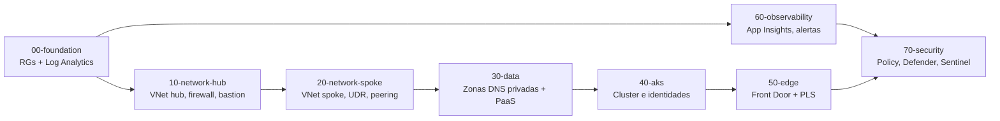

# Fases de despliegue

Cada fase es un state de Terraform independiente. Se comunican leyendo el state
de las anteriores con `terraform_remote_state`, nunca por variables copiadas a
mano.

## Por que separar en fases y no un solo state

- **Radio de explosion.** Un error en la fase de datos no puede tocar la red del
  hub, porque ni siquiera esta en el mismo state.
- **Tiempo de plan.** Un state monolitico con AKS, datos y borde tarda minutos en
  refrescarse en cada PR. Ocho states pequenos tardan segundos, y solo se
  planifican los que cambiaron.
- **Permisos.** Permite en el futuro que la fase 70 corra con una identidad
  distinta de la que crea la red.
- **Orden real de dependencias.** El orden no es una convencion, esta codificado
  en `needs:` entre jobs y en las lecturas de remote state.

## Orden y dependencias

| Fase | Contenido | Depende de | Costo del andamiaje |
|---|---|---|---|
| `00-foundation` | 7 resource groups, Log Analytics workspace | — | ~0 (LAW cobra por GB ingerido) |
| `10-network-hub` | VNet hub `10.0.0.0/22` y sus 7 subredes | 00 | 0 |
| `20-network-spoke` | VNet spoke `10.10.0.0/16`, route table, peering | 00, 10 | 0 |
| `30-data` | Zonas DNS privadas ligadas a hub y spoke | 00, 10, 20 | ~0.50 USD/mes por zona |
| `40-aks` | Identidades administradas del cluster y de cada microservicio | 00, 20, 30 | 0 |
| `50-edge` | (vacia en el andamiaje) Front Door, WAF, PLS | 00, 20, 30 | 0 |
| `60-observability` | Application Insights, grupo de accion | 00 | ~0 |
| `70-security` | Asignaciones de Azure Policy | 00 | 0 |

Aplicar el andamiaje completo en dev y prod cuesta esencialmente nada: no hay
un solo recurso con tarifa fija por hora.

## Por que la seguridad va al final

La fase 70 asigna politicas de Azure en modo `deny`. Si se aplicara primero, una
politica como "no se permiten IPs publicas" bloquearia la creacion del propio
Azure Firewall en la fase 10. El orden correcto es construir, verificar y
despues sellar.

Por eso las asignaciones ademas arrancan con `enforce = false` (`DoNotEnforce`):
primero se mide el impacto sobre el inventario real, y solo entonces se cambia a
bloqueo.

## Los feature flags de costo

Las fases traen los recursos caros declarados como TODO y protegidos por
variables `enable_*` que por defecto estan en `false`. Si alguien enciende un
flag sin haber implementado el recurso, una `precondition` hace fallar el
**plan**, no el apply.

| Flag | Fase | Costo mensual aproximado |
|---|---|---|
| `enable_firewall` | 10 | ~900 USD (Azure Firewall Premium) |
| `enable_bastion` | 10 | ~140 USD |
| `enable_dns_resolver` | 10 | ~180 USD |
| `enable_postgresql` | 30 | desde ~350 USD con HA zona-redundante |
| `enable_redis` | 30 | ~400 USD (Premium P1) |
| `enable_service_bus` | 30 | ~670 USD (Premium, 1 unidad) |
| `enable_acr` | 30 | ~50 USD (Premium) mas replicacion |
| `enable_ai_search` | 30 | ~250 USD (Standard S1) |
| `enable_cluster` | 40 | ~600 USD de piso mas 73 USD del tier Standard |
| `enable_front_door` | 50 | ~330 USD mas trafico |
| `enable_apim` | 50 | ~2800 USD (Premium) |
| `enable_grafana` | 60 | ~50 USD |
| `enable_defender_plans` | 70 | por consumo, ~7 USD/vCore/mes en Containers |
| `enable_sentinel` | 70 | por GB analizado |

## Orden de implementacion sugerido

1. Correr el andamiaje completo en dev y verificar que el pipeline funciona de
   punta a punta. Costo: cero.
2. Fase 10: firewall y bastion. Es lo que desbloquea el egreso controlado y el
   acceso administrativo.
3. Fase 30: Key Vault y ACR primero (baratos y necesarios para todo lo demas),
   despues PostgreSQL.
4. Fase 40: cluster con un solo node pool de sistema.
5. Fase 50: Front Door y Private Link Service, que necesitan el ILB del ingress
   ya desplegado por GitOps.
6. Fase 60 y 70 al final, con la plataforma ya en pie.
